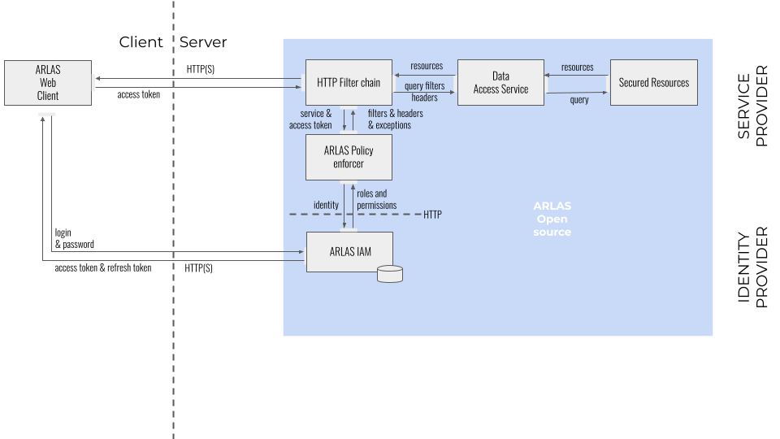

# ARLAS-IAM

## What is it?
This module aims at adding an Identity and Access Management (IAM) to the ARLAS stack.  
IAM provides authentication (user login) and authorisation (permissions to access data and APIs) services to ARLAS
components: server, WUI, hub, builder...

The stack can be started with or without IAM. When started with, ARLAS can be connected to various "auth" platforms:
- [Auth0](https://auth0.com/)
- [Keycloak](https://www.keycloak.org/)
- [ARLAS IAM](#iam-server)

The platform to connect to is selected by the way of a specific **Policy Enforcer** which basically is a servlet request
filter activated in backend components (server, persistence...).

The open source ARLAS stack can only be started with Keycloack and Auth0 implementations (or a no policy enforcer,
i.e. no authentication).  
ARLAS IAM is only available with ARLAS Enterprise.

IAM is composed of 2 main components:
1. a set of implementations of ARLAS PolicyEnforcer (interface available in the ARLAS-server/arlas-commons module: `io.arlas.filter.core.PolicyEnforcer`)
    - Auth0 implementation (`io.arlas.filter.impl.Auth0PolicyEnforcer`)
    - Keycloak implementation (`io.arlas.filter.impl.KeycloakPolicyEnforcer`)
    - ARLAS IAM implementation (`io.arlas.filter.impl.HTTPPolicyEnforcer`)
    - do nothing implementation (`io.arlas.filter.impl.NoPolicyEnforcer`)
2. an IAM server, which is not covered in this document, because it is not open source.

## Policy Enforcers configuration
The policy enforcers are in the `arlas-commons` module.  
The implementation to be activated must be defined in the backend component configuration:

| Environment variable    | configuration variable  | Default                               | Possible values                                                                                                                      |
|-------------------------|-------------------------|---------------------------------------|--------------------------------------------------------------------------------------------------------------------------------------|
| ARLAS_AUTH_POLICY_CLASS | arlas_auth_policy_class | io.arlas.filter.impl.NoPolicyEnforcer | io.arlas.filter.impl.Auth0PolicyEnforcer io.arlas.filter.impl.KeycloakPolicyEnforcer io.arlas.filter.impl.HTTPPolicyEnforcer |

Further configuration may be required depending on the chosen implementation:

| Environment variable         | configuration variable                 | Default                                                   | Policy enforcer |
|------------------------------|----------------------------------------|-----------------------------------------------------------|-----------------|
| ARLAS_AUTH_PUBLIC_URIS       | arlas_auth.public_uris                 | swagger.\*:\*                                             | All             |
| ARLAS_HEADER_USER            | arlas_auth.header_user                 | arlas-user                                                | All             |
| ARLAS_HEADER_GROUP           | arlas_auth.header_group                | arlas-groups                                              | All             |
| ARLAS_ANONYMOUS_VALUE        | arlas_auth.anonymous_value             | anonymous                                                 | All             |
| ARLAS_CLAIM_ROLES            | arlas_auth.claim_roles                 | http://arlas.io/roles                                     | Auth0,HTTP      |
| ARLAS_CLAIM_PERMISSIONS      | arlas_auth.claim_permissions           | http://arlas.io/permissions                               | Auth0,HTTP      |
| ARLAS_AUTH_CERT_URL          | arlas_auth.certificate_url             | none                                                      | Auth0           |
| ARLAS_AUTH_PERMISSION_URL    | arlas_auth.permission_url              | http://arlas-iam-server/arlas_iam_server/auth/permissions | HTTP            |
| ARLAS_AUTH_KEYCLOAK_REALM    | arlas_auth.keycloak.realm              | arlas                                                     | Keycloak        |
| ARLAS_AUTH_KEYCLOAK_URL      | arlas_auth.keycloak.auth-server-url    | http://keycloak:8080/auth                                 | Keycloak        |
| ARLAS_AUTH_KEYCLOAK_RESOURCE | arlas_auth.keycloak.resource           | arlas                                                     | Keycloak        |
| ARLAS_AUTH_KEYCLOAK_SECRET   | arlas_auth.keycloak.credentials.secret | none                                                      | Keycloak        |

## Protection rules
ARLAS IAM allows the enforcement of two kinds of protection mechanisms. They are achieved by the definition of rules and
(HTTP) headers that are collected by the *Policy Enforcer* and transferred to the ARLAS backend component it protects.  
They are strings of characters with a specific formatting that are expected to be found in the access token and/or permission token
(RPT: requesting party token) in specific claims.

### Protection of ARLAS WUI dashboards: groups
By default dashboards are only viewable and editable by their creator (owner).  
One can share (view and/or edit rights) a dashboard with any group of users they already belong to,
e.g. if `userA` belongs to groups `grp1` and `grp2`, they can share their dashboards with part or all of these groups,
and these groups only.  
It implies that prior to sharing a dashboard, groups must be created and assigned to users.  
This is done by assigning specific roles whose names are formatted as `group/config.json/GRPNAME`,
e.g. `group/config.json/spot6`(in this example, the group name is `spot6` and will be displayed as such in ARLAS hub).
A good practice is to assign data protection headers to these roles in order to enforce an even better protection level, e.g.:
- `group/config.json/spot6`
    - `h:column-filter:spot6_*:*`

### Protection of ARLAS APIs: rules
The actions a user can do, i.e. API endpoints and HTTP verbs, can be limited to a configurable list of URIs.
The expected format is `rule:resource:verbs` or `r:resource:verbs`. The `resource` part of the rule is used as a regex
to match a requested URI.
Examples:
- `r:explore/.*:GET,POST`
- `r:collections/.*:GET`

These rules do not need to be configured as they are already associated to default roles defined in the IAM module.  
These roles are:
- `role/arlas/user` (rules to view data)
- `role/arlas/tagger` (rules to use the Tagger backend)
- `role/arlas/builder` (rules to create/edit/delete ARLAS WUI dashboards)
- `role/arlas/owner` (rules to manage collections in ARLAS server and organisations/users in ARLAS IAM server)
- `role/arlas/importer` (rules to import collections via the dedicated ARLAS server endpoint, mainly used by M2M processes)
- `role/iam/admin` (rules to manage organisations and users in ARLAS IAM server)

The associated rules configured for these roles can be found in the file `arlas-commons/src/main/resources/roles.yaml`.

### Protection of data: headers
The collections and data a user can read or write can be limited by the use of existing ARLAS mechanisms (column filter,
partition filter).  
The expected format is `header:name:value` or `h:name:value` (the value can contain the character `:`).  
Examples (refer to ARLAS documentation for details on how to write them):
- `h:column-filter:*:*`
- `h:partition-filter:{"f":[[{"field":"sensor","op": "eq","value": "SPOT6"}]]}`

These must be defined and associated to roles (preferably 'group' roles) in order to be available in the permission token.  
If multiple instances of the same header name are found in the resulting list of permissions, they are merged into a
single multi-value header (values separated by commas).

## Protection flow
ARLAS backend components follow several steps in order to enforce IAM, once a user is logged in and has acquired ID and access tokens.

1. The request to a given ARLAS URI is intercepted by the configured *Policy Enforcer*:
    1. if no HTTP header `Authorization: bearer <access token>` is provided
        1. but the URI is configured to be public (via `ARLAS_AUTH_PUBLIC_URIS`) then access is granted
        2. else access is rejected with code `401 Unauthorized`
    2. else continue to next step
2. Get permission token (RPT) from auth server (optionally filtered with an organisation name via a `arlas-org-filter` header, only for ARLAS IAM)
3. Get `subject` (user ID) from RPT and inject it in a configurable HTTP header (via `ARLAS_HEADER_USER`)
4. Get roles claim from RPT (via `ARLAS_CLAIM_ROLES`) and inject groups in a configurable HTTP header (via `ARLAS_HEADER_GROUP`)
5. Get permissions from RPT (via `ARLAS_CLAIM_PERMISSIONS`) and compare requested URI with allowed and public URIs (including HTTP verb, i.e. GET, POST, PUT, DELETE...)
    1. if not allowed then access is rejected with code `403 Forbidden`
    2. else add headers that are defined in permissions to the request
6. Forward resulting request to the ARLAS backend component

## Keycloak

### Concepts
Keycloak is configured through multiple items. ARLAS uses only a subset of them, which are described here.

- **Realm**: a realm is the container of the configuration used by an ARLAS instance (clients, users, groups...)
- **Client**: a client contains the configuration that controls the ARLAS components access.
    - **Client roles**: roles can be given to users in order to control their rights. Some role names must follow some specific naming rules (such as ARLAS groups).
    - **Authorization/Resources**: resources are a list of ARLAS rules and headers (see before). Their **names** contain the rule/header to be sent to ARLAS.
      Resources with the same **type** value can be referenced together through that value in *permissions*.
    - **Authorization/Policies**: policies are pieces of logic that are used to check a condition.
      For now only "role policies" are used: it checks if a *user* has a given *client role*.
    - **Authorization/Permissions**: only "resource-based" permissions are used. They associate *resources* or *resource types* with *policies*.
      Whenever a *permission*'s *policy* matches, the associated *resources* are sent to ARLAS in the authentication process of a *user* (in the permission claim of the RPT)
- **Groups**: are used to group together a list of *client roles* in order to facilitate their allocation to *users*.
  Modifications to a group (adding/removing roles) will be spread to all users belonging to the group. This is not the same concept as an ARLAS group.
- **Users**: are accounts allowed to connect to ARLAS. They can (and should) belong to keycloak *groups* and can also be mapped to individual *client roles*.

**/!\ The list of *client roles* associated to a user must result in at least one *resource* once the *permissions* are
evaluated, as "no permissions" equals to 403 response (and not an empty permission list) when requesting the RPT from Keycloak**

### Manual configuration
In order to configure Keycloak from scratch, follow this tutorial, as a minimum set of settings to make it work with ARLAS.  
Another way is to import the default configuration file given with this module (see next section).

0. In order to remove limitations in permissions size (default is 256 characters), one must alter the database:  
   `ALTER TABLE public.resource_server_resource ALTER COLUMN name TYPE TEXT`
1. Create a realm. Its name must be configured in `ARLAS_AUTH_KEYCLOAK_REALM`. Switch to the realm administration console.
   The following lines refer to the appropriate menu items from the console with a prefix text in parentheses (left menu/right tabs/...), e.g. (Clients/Lookup)
2. *(Clients/Lookup/Create)* Create a new client with:
    - Client ID=`arlas` (must be configured in `ARLAS_AUTH_KEYCLOAK_RESOURCE`)
    - Client Protocol=`openid-connect`
    - Save
3. *(Clients/Arlas/Settings)* Change the following configuration items:
    - Access Type=`confidential`
    - Implicit Flow Enabled=`ON`
    - Authorization Enabled=`ON`
    - Root URL=(insert Arlas instance root URL, e.g. `https://arlas.mydomain.com`)
    - Valid Redirect URIs=
        - `/*`
    - Web Origins=`+`
    - Save
4. *(Clients/Arlas/Credentials)* Select Client Authenticator "Client Id and Secret" and copy the Secret value to `ARLAS_AUTH_KEYCLOAK_SECRET`
5. *(Clients/Arlas/Roles)* Add the following roles:
    - `group/public` (required if the need to share dashboard to anonymous users)
    - `role/arlas/builder` (rules to create/edit/delete ARLAS WUI dashboards)
    - `role/arlas/importer` (rule to import collections via the dedicated ARLAS server endpoint, mainly used by M2M processes)
    - `role/arlas/owner` (rules to manage collections in ARLAS server and organisations/users in ARLAS IAM server)
    - `role/arlas/tagger` (rules to use the Tagger backend)
    - `role/arlas/user`  (rules to view data)
    - `group/config.json/XXXXX`: add as many groups as needed where `XXXXX` will be the name of groups available to share
      dashboards in ARLAS hub and that can be associated to data filters.
6. *(Clients/Arlas/Authorization/Policies)* Add role policies for each new group you have added.
   Don't select a Realm Role but choose the `arlas` Client and choose a Client Role. Keep the logic to Positive.
7. *(Clients/Arlas/Authorization/Resources)* Add any resource `header:name:value` (as name) you need (optionally setting
   a `type` if you need to map more than one in a `group/config.json/...` *role*) and create permission (select relevant role policy).
   A basic example you might need to authorize a user to see all the fields of all the collections is a resource
   named `h:column-filter:*:*`. Create a permission for this resource and apply `role/arlas/user` to it.
8. *(Groups)* Add groups with some `arlas` *client roles* according to the way you want to assign permissions to users.
9. *(Users)* Add users:
    - Username= choose name
    - Groups= choose groups
    - Role mappings: assign relevant individual roles from `arlas` *client roles* if not assigned through groups
    - Save
10. *(Users/\<user\>/Credentials)* Set password
11. *(Clients/Lookup/Create)* Create a new client with:
    - Client ID=arlasm2m
    - Client Protocol=openid-connect
    - Save
12. *(Clients/Arlasm2m/Settings)* Change the following configuration items:
    - Access Type=confidential
    - Switch off Standard Flow Enabled
    - Switch on Service Accounts Enabled
    - Save
13. *(Clients/Arlasm2m/Service Account Roles)* Select `arlas` in the Client Roles drop down list and add selected roles:
    - role/arlas/user
    - role/arlas/owner
    - role/arlas/importer

### Import configuration
0. In order to remove limitations in permissions size (default is 256 characters), one must alter the database:  
   `ALTER TABLE public.resource_server_resource ALTER COLUMN name TYPE TEXT`
1. In the realm selection drop down list, select "Add realm".
2. Select the file to import and click `Create` (template is in `arlas-commons/src/main/resources/realm-export.json`)
3. *(Clients/Arlas/Credentials)* Select Client Authenticator "Client Id and Secret", regenerate the secret,
   and copy the Secret value to `ARLAS_AUTH_KEYCLOAK_SECRET`
4. *(Clients/Arlas/Settings)* Change the following configuration items:
    - Root URL=(insert Arlas instance root URL, e.g. `https://arlas.mydomain.com`)
5. *(Clients/Arlasm2m/Credentials)* Select Client Authenticator "Client Id and Secret", regenerate the secret (and copy if needed)
6. *(Clients/Arlas/Roles)* Add the following roles:
    - `group/config.json/XXXXX`: add as many groups as needed where `XXXXX` will be the name of groups available to share
      dashboards in ARLAS hub and that can be associated to data filters.
7. *(Clients/Arlas/Authorization/Policies)* Add role policies for each new group you have added
8. *(Clients/Arlas/Authorization/Resources)* Add any `header:name:value` you need (optionally setting a `type` if you need
   to map more than one in a `group/config.json/...` *role*) and create permission (select relevant role policy)
9. *(Groups)* Add groups with some `arlas` *client roles* according to the way you want to assign permissions to users.
10. *(Users)* Add users:
    - Username= choose name
    - Groups= choose groups
    - Role mappings: assign relevant individual roles from `arlas` *client roles* if not assigned through groups
    - Save
11. *(Users/\<user\>/Credentials)* Set password

